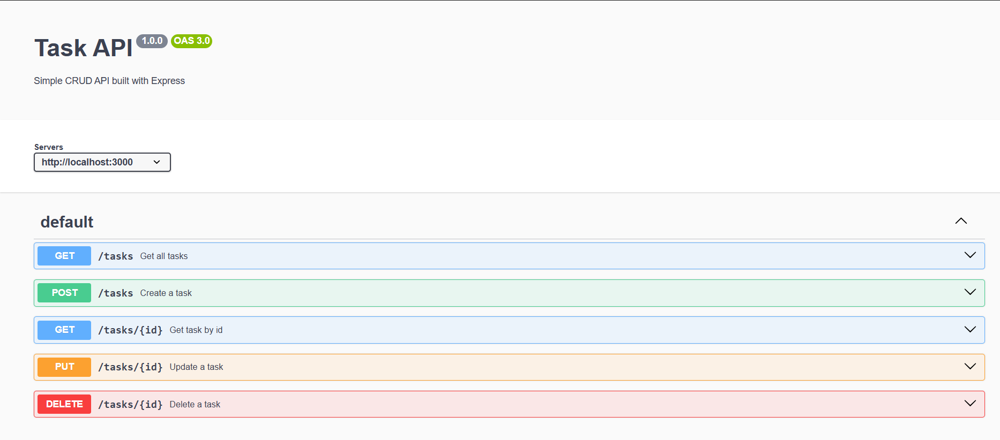

# Task API

A simple CRUD API built with Node.js and Express.

This project was developed as part of the Backend AI Engineering Week 2 assignment. It provides a REST API to create, read, update and delete tasks using an in-memory array.
## Installation

Clone the repository:

```bash
git clone https://github.com/asmaebihkak24/week2-crud-api.git
```

Go to the project folder:

```bash
cd week2-crud-api
```

Install dependencies:

```bash
npm install
```
## Run the server

```bash
node server.js
```

The server runs on:

```
http://localhost:3000
```

Swagger UI:

```
http://localhost:3000/docs
```## API Endpoints

| Method | Endpoint | Description |
|--------|----------|-------------|
| GET | / | API information |
| GET | /health | Health check |
| GET | /tasks | Get all tasks |
| GET | /tasks/{id} | Get one task |
| POST | /tasks | Create a new task |
| PUT | /tasks/{id} | Update a task |
| DELETE | /tasks/{id} | Delete a task |
## Example

```bash
curl -i http://localhost:3000/tasks
```

Response:

```json
[
  {
    "id": 1,
    "title": "Learn Express",
    "done": false
  }
]
```

## Swagger UI


